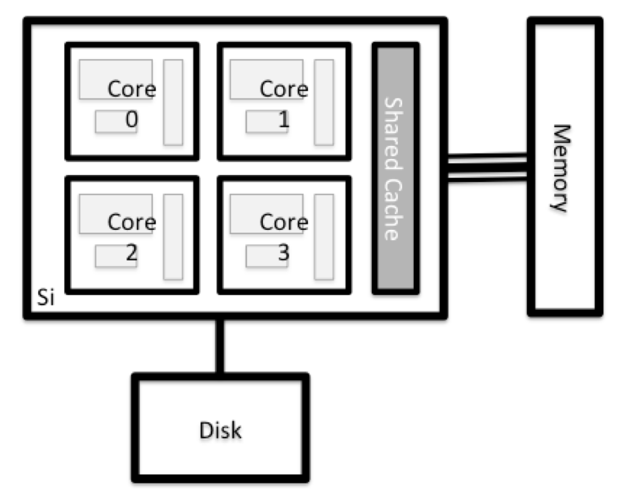

::: questions
- "What is an HPC system?"
- "How does an HPC system work?"
- "How do I log on to a remote HPC system?"
:::

::: objectives
- "Connect to a remote HPC system."
- "Understand the general HPC system architecture."
:::

## What Is an HPC System?

The words "cloud", "cluster", and the phrase "high-performance computing" or
"HPC" are used a lot in different contexts and with various related meanings.
So what do they mean? And more importantly, how do we use them in our work?

The *cloud* is a generic term commonly used to refer to computing resources
that are a) *provisioned* to users on demand or as needed and b) represent real
or *virtual* resources that may be located anywhere on Earth. For example, a
large company with computing resources in Brazil, Zimbabwe and Japan may manage
those resources as its own *internal* cloud and that same company may also
utilize commercial cloud resources provided by Amazon or Google. Cloud
resources may refer to machines performing relatively simple tasks such as
serving websites, providing shared storage, providing web services (such as
e-mail or social media platforms), as well as more traditional compute
intensive tasks such as running a simulation.

The term *HPC system*, on the other hand, describes a stand-alone resource for
computationally intensive workloads. They are typically comprised of a
multitude of integrated processing and storage elements, designed to handle
high volumes of data and/or large numbers of floating-point operations
([FLOPS](https://en.wikipedia.org/wiki/FLOPS)) with the highest possible
performance. For example, all of the machines on the
[Top-500](https://www.top500.org) list are HPC systems. To support these
constraints, an HPC resource must exist in a specific, fixed location:
networking cables can only stretch so far, and electrical and optical signals
can travel only so fast.

The word "cluster" is often used for small to moderate scale HPC resources less
impressive than the [Top-500](https://www.top500.org). Clusters are often
maintained in computing centers that support several such systems, all sharing
common networking and storage to support common compute intensive tasks.

## Logging In

The first step in using a cluster is to establish a connection from our laptop
to the cluster. When we are sitting at a computer (or standing, or holding it
in our hands or on our wrists), we have come to expect a visual display with
icons, widgets, and perhaps some windows or applications: a graphical user
interface, or GUI. Since computer clusters are remote resources that we connect
to over often slow or laggy interfaces (WiFi and VPNs especially), it is more
practical to use a command-line interface, or CLI, in which commands and
results are transmitted via text, only. Anything other than text (images, for
example) must be written to disk and opened with a separate program.

If you have ever opened the Windows Command Prompt or macOS Terminal, you have
seen a CLI. If you have already taken The Carpentries' courses on the UNIX
Shell or Version Control, you have used the CLI on your local machine somewhat
extensively. The only leap to be made here is to open a CLI on a *remote*
machine, while taking some precautions so that other folks on the network can't
see (or change) the commands you're running or the results the remote machine
sends back. We will use the Secure SHell protocol (or SSH) to open an encrypted
network connection between two machines, allowing you to send & receive text
and data without having to worry about prying eyes.

{alt="Connect to cluster"}

Make sure you have a SSH client installed on your laptop. Refer to the
[setup](../index.md) section for more details. SSH clients are
usually command-line tools, where you provide the remote machine address as the
only required argument. If your username on the remote system differs from what
you use locally, you must provide that as well. If your SSH client has a
graphical front-end, such as PuTTY or MobaXterm, you will set these arguments
before clicking "connect." From the terminal, you'll write something like `ssh
userName@hostname`, where the "@" symbol is used to separate the two parts of a
single argument.

Go ahead and open your terminal or graphical SSH client, then log in to the
cluster using your username and the remote computer you can reach from the
outside world.

```bash
[you@laptop:~]$ ssh -p 6868 yourUsername@ssh.lsc.ic.unicamp.br
```

Remember to replace `yourUsername` with your username or the one
supplied by the instructors. You may be asked for your password. Watch out: the
characters you type after the password prompt are not displayed on the screen.
Normal output will resume once you press `Enter`.

The step above logs you in from outside to the cluster network. Now that you are on the same network as the cluster, you can log in to the cluster head node.

```bash
[yourUsername@ssh ~]$ ssh yourUsername@sorgan
``` 
Again, you may be asked for your password. Once you are logged in, you should see a different prompt, indicating that you are now on the cluster head node. 

To avoid typing your password every time you log in, you can set up SSH keys from the login node to the head node in the same way we did from outside to the login node. Refer to the [Connecting to a remote HPC system](episodes/11-connecting) episode for more details.

::: callout
# Dedicated Login Nodes
In Sorgan, there is no direct access to the cluster head node from outside, so you must first log in to the login node and then connect to the head node.
If you are inside the LSC network, you can log in to the head node directly.

```bash
[you@laptop:~]$ ssh yourUsername@sorgan.lsc.ic.unicamp.br
```
:::

## Where Are We?

Very often, many users are tempted to think of a high-performance computing
installation as one giant, magical machine. Sometimes, people will assume that
the computer they've logged onto is the entire computing cluster. So what's
really happening? What computer have we logged on to? The name of the current
computer we are logged onto can be checked with the `hostname` command. (You
may also notice that the current hostname is also part of our prompt!)

```bash
[yourUsername@sorgan ~]$ hostname
```

```output
sorgan
```

::: challenge

## What's in Your Home Directory?

The system administrators may have configured your home directory with some
helpful files, folders, and links (shortcuts) to space reserved for you on
other filesystems. Take a look around and see what you can find.
*Hint:* The shell commands `pwd` and `ls` may come in handy.
Home directory contents vary from user to user. Please discuss any
differences you spot with your neighbors.

:::: solution

## It's a Beautiful Day in the Neighborhood

The deepest layer should differ: `yourUsername` is uniquely yours.
Are there differences in the path at higher levels?

If both of you have empty directories, they will look identical. If you
or your neighbor has used the system before, there may be differences. What
are you working on?

Use `pwd` to **p**rint the **w**orking **d**irectory path:

```bash
[yourUsername@sorgan ~]$ pwd
```

You can run `ls` to **l**i**s**t the directory contents, though it's
possible nothing will show up (if no files have been provided). To be sure,
use the `-a` flag to show hidden files, too.

```bash
[yourUsername@sorgan ~]$ ls -a
```

At a minimum, this will show the current directory as `.`, and the parent
directory as `..`.

::::
:::

## Nodes

Individual computers that compose a cluster are typically called *nodes*
(although you will also hear people call them *servers*, *computers* and
*machines*). On a cluster, there are different types of nodes for different
types of tasks. The node where you are right now is called the *head node*,
*master node* or *submit node*. 

The first node you use to login was the *login node*. A login node serves as an access point to the cluster. As a gateway, it is well suited for uploading and downloading files. The *head node*, on the other hand, serves as the primary interface for setting up
software, and running quick tests. Generally speaking, the head node should
not be used for time-consuming or resource-intensive tasks. You should be alert
to this, and check our documentation for details of
what is and isn't allowed. In these lessons, we will avoid running jobs on the
head node.

::: callout

## Dedicated Transfer Nodes

If you want to transfer larger amounts of data to or from the cluster, some
systems offer dedicated nodes for data transfers only. The motivation for
this lies in the fact that larger data transfers should not obstruct
operation of the login node for anybody else. Check with your cluster's
documentation or its support team if such a transfer node is available. As a
rule of thumb, consider all transfers of a volume larger than 500 MB to 1 GB
as large. But these numbers change, e.g., depending on the network connection
of yourself and of your cluster or other factors.
:::

The real work on a cluster gets done by the *worker* (or *compute*) *nodes*.
Worker nodes come in many shapes and sizes, but generally are dedicated to long
or hard tasks that require a lot of computational resources.

All interaction with the worker nodes is handled by a specialized piece of
software called a scheduler (the scheduler used in this lesson is called
**Slurm**). We'll learn more about how to use the
scheduler to submit jobs next, but for now, it can also tell us more
information about the worker nodes.

For example, we can view all of the worker nodes by running the command
`sinfo`.

```bash
[yourUsername@sorgan ~]$ sinfo
```


```output
PARTITION AVAIL  TIMELIMIT  NODES  STATE NODELIST
all          up   infinite      3    mix sorgan-gpu[1-3]
all          up   infinite      4  alloc sorgan-cpu[2-5]
all          up   infinite      4   idle sorgan-bigmem,sorgan-cpu[1,6],sorgan-gpu4
gpu          up   infinite      3    mix sorgan-gpu[1-3]
gpu          up   infinite      1   idle sorgan-gpu4
cpu*         up   infinite      4  alloc sorgan-cpu[2-5]
cpu*         up   infinite      3   idle sorgan-bigmem,sorgan-cpu[1,6]
ib           up   infinite      2    mix sorgan-gpu[1,3]
ib           up   infinite      3  alloc sorgan-cpu[2-4]
ib           up   infinite      1   idle sorgan-cpu1
```

There are also specialized machines used for managing disk storage, user
authentication, and other infrastructure-related tasks. Although we do not
typically logon to or interact with these machines directly, they enable a
number of key features like ensuring our user account and files are available
throughout the HPC system.

## What\'s in a Node?

All of the nodes in an HPC system have the same components as your own laptop
or desktop: *CPUs* (sometimes also called *processors* or *cores*), *memory*
(or *RAM*), and *disk* space. CPUs are a computer's tool for actually running
programs and calculations. Information about a current task is stored in the
computer's memory. Disk refers to all storage that can be accessed like a file
system. This is generally storage that can hold data permanently, i.e. data is
still there even if the computer has been restarted. While this storage can be
local (a hard drive installed inside of it), it is more common for nodes to
connect to a shared, remote fileserver or cluster of servers.

{max-width="20%" alt="Node anatomy" caption=""}

::: challenge

## Explore Your Computer

Try to find out the number of CPUs and amount of memory available on your
personal computer.
Note that, if you're logged in to the remote computer cluster, you need to
log out first. To do so, type `Ctrl+d` or `exit`:

```bash
[yourUsername@sorgan ~]$ exit
[yourUsername@ssh ~]$ exit
[you@laptop:~]$
```

:::: solution

There are several ways to do this. Most operating systems have a graphical
system monitor, like the Windows Task Manager. More detailed information can
sometimes be found on the command line. For example, some of the commands used
on a Linux system are:

Run system utilities

```bash
[you@laptop:~]$ nproc --all
[you@laptop:~]$ free -m
```

Read from `/proc`

```bash
[you@laptop:~]$ cat /proc/cpuinfo
[you@laptop:~]$ cat /proc/meminfo
```

Use a system monitor

```bash
[you@laptop:~]$ htop
```

::::
:::

::: challenge

## Explore the login node

Now compare the resources of your computer with those of the head node.

:::: solution

```bash
[you@laptop:~]$ ssh -p 6868 yourUsername@ssh.lsc.ic.unicamp.br
[yourUsername@ssh ~]$ ssh sorgan
[yourUsername@sorgan ~]$ nproc --all
[yourUsername@sorgan ~]$ free -m
```

You can get more information about the processors using `lscpu`,
and a lot of detail about the memory by reading the file `/proc/meminfo`:

```bash
[yourUsername@sorgan ~]$ less /proc/meminfo
```

You can also explore the available filesystems using `df` to show **d**isk
**f**ree space. The `-h` flag renders the sizes in a human-friendly format,
i.e., GB instead of B. The **t**ype flag `-T` shows what kind of filesystem
each resource is.

```bash
[yourUsername@sorgan ~]$ df -Th
```
::::
:::

::: discussion
The local filesystems (ext, tmp, xfs, zfs) will depend on whether you're
on the same login node (or compute node, later on). Networked filesystems
(beegfs, cifs, gpfs, nfs, pvfs) will be similar --- but may include
yourUsername, depending on how it is [mounted](
https://en.wikipedia.org/wiki/Mount_(computing)).
:::

::: callout
## Shared Filesystems

This is an important point to remember: files saved on one node
(computer) are often available everywhere on the cluster!

:::


::: challenge

## Explore a Worker Node

Finally, let's look at the resources available on the worker nodes
where your jobs will actually run. Try running this command to see
the name, CPUs and memory available on one of the worker nodes:

```bash
 sinfo -o "%n %c %m" | column -t
```
:::

::: discussion
## Compare Your Computer, the login node and the compute node
Compare your laptop's number of processors and memory with the numbers you
see on the cluster head node and worker node. Discuss the differences with
your neighbor.

What implications do you think the differences might have on running your
research work on the different systems and nodes?
:::

::: callout
## Differences Between Nodes

Many HPC clusters have a variety of nodes optimized for particular workloads.
Some nodes may have larger amount of memory, or specialized resources such as
Graphical Processing Units (GPUs).
:::

With all of this in mind, we will now cover how to talk to the cluster's
scheduler, and use it to start running our scripts and programs!

::: keypoints
 - "An HPC system is a set of networked machines."
 - "HPC systems typically provide login nodes and a set of worker nodes."
 - "The resources found on independent (worker) nodes can vary in volume and
   type (amount of RAM, processor architecture, availability of network mounted
   filesystems, etc.)."
 - "Files saved on one node are available on all nodes."
:::
